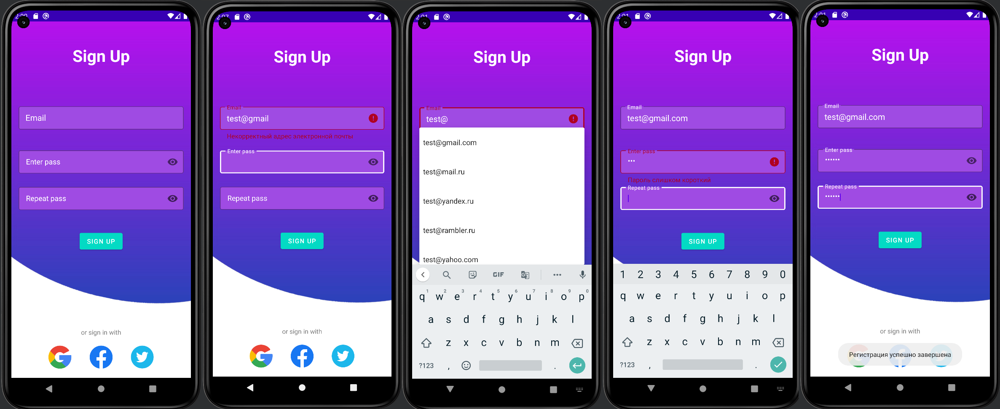

<p align = "center">МИНИСТЕРСТВО НАУКИ И ВЫСШЕГО ОБРАЗОВАНИЯ
РОССИЙСКОЙ ФЕДЕРАЦИИ
ФЕДЕРАЛЬНОЕ ГОСУДАРСТВЕННОЕ БЮДЖЕТНОЕ
ОБРАЗОВАТЕЛЬНОЕ УЧРЕЖДЕНИЕ ВЫСШЕГО ОБРАЗОВАНИЯ
«САХАЛИНСКИЙ ГОСУДАРСТВЕННЫЙ УНИВЕРСИТЕТ»</p>
<br><br><br><br><br><br>
<p align = "center">Институт естественных наук и техносферной безопасности<br>Кафедра информатики<br>Чагочкин Никита</p>
<br><br><br>
<p align = "center">Проверка адреса email<br>01.03.02 Прикладная математика и информатика</p>
<br><br><br><br><br><br><br><br><br><br><br><br>
<p align = "right">Научный руководитель<br>
Соболев Евгений Игоревич</p>
<br><br><br>
<p align = "center">г. Южно-Сахалинск<br>2023 г.</p>

***
# <p align = "center">Задача </p>
Проверка формата электронной почты. Пример: user@gmail не является действительным адресом электронной почты
Пользовательский интерфейс должен показывать, действителен или нет адрес электронной почты. При необходимости интерфейс должен указать, что не так с адресом.<br>Проверить существование введённого домена
Указать, что неправильно в введённом имени
Предложить Автозаполнение доменного имени самыми вероятными и популярными доменными именами. Пример: если пользователь вводит «user@», то продолжениями могут быть «user@gmail.com», «user@yahoo.com» и т.д. Если пользователь уточняет «user@g», то продолжениями могут быть популярные домены, начинающиеся с «g». Например: «user@gmail.com», «user@gmail.co.uk»
***
# <p align = "center">Решение </p>

## <p align = "center">Проверка введеных данных</p>
### Email
Для проверки корректоности Email адреса я использовал встроенный в Android Studio патерн

        android.util.Patterns.EMAIL_ADDRESS

### Код
```Kotlin
        email.editText?.addTextChangedListener(object : TextWatcher {
                    override fun onTextChanged(cs: CharSequence, arg1: Int, arg2: Int, arg3: Int) {
                        if(email.editText?.text.toString().contains("@")){
                            val curEmail=email.editText?.text.toString().substring(0,email.editText?.text.toString().indexOf("@"))
                            possibleEmails= arrayOf()
                                    for (i in domains){
                                    possibleEmails+=curEmail+"@"+i
                            }
                            var adapter = ArrayAdapter(this@MainActivity, android.R.layout.simple_dropdown_item_1line, possibleEmails)
                            emailText.setAdapter(adapter)

                        }
                        if(email.editText?.text.toString()==""){
                            email.error="Введите адрес электронной почты"
                        }else if(!android.util.Patterns.EMAIL_ADDRESS.matcher(email.editText?.text.toString()).matches()){
                            email.error="Некорректный адрес электронной почты"
                        }else email.error=null
                    }

                    override fun beforeTextChanged(s: CharSequence, arg1: Int, arg2: Int, arg3: Int) {}
                    override fun afterTextChanged(arg0: Editable) {

                    }
                })
```
### Проверка паролей
```Kotlin
                pass.editText?.addTextChangedListener(object : TextWatcher {
                    override fun onTextChanged(cs: CharSequence, arg1: Int, arg2: Int, arg3: Int) {
                        if(pass.editText?.text.toString().length <6){
                            pass.error="Пароль слишком короткий"
                        }
                        else if(pass.editText?.text.toString().length >14){
                            pass.error="Пароль слишком длинный"
                        }else pass.error=null
                    }
                    override fun beforeTextChanged(s: CharSequence, arg1: Int, arg2: Int, arg3: Int) {}
                    override fun afterTextChanged(arg0: Editable) {

                    }
                })
                sec_pass.editText?.addTextChangedListener(object : TextWatcher {
                    override fun onTextChanged(cs: CharSequence, arg1: Int, arg2: Int, arg3: Int) {
                        if(sec_pass.editText?.text.toString()!=pass.editText?.text.toString()){
                            sec_pass.error="Пароли не совпадают"
                        }else sec_pass.error=null
                    }

                    override fun beforeTextChanged(s: CharSequence, arg1: Int, arg2: Int, arg3: Int) {}
                    override fun afterTextChanged(arg0: Editable) {

                    }
                })
```
### Кнопка авторизации
```Kotlin
        loginButton.setOnClickListener {
                    if(email.error==null && pass.error==null && sec_pass.error==null){
                        Toast.makeText(this,"Регистрация успешно завершена",Toast.LENGTH_LONG).show()
                    }else  Toast.makeText(this,"Заполните все поля корректно",Toast.LENGTH_LONG).show()
                }
```
## <p align = "center">XML</p>
Для более красивого UX я использовал библиотеку компонентов Material
### Подключаем

        implementation 'com.google.android.material:material:1.9.0'
### Макет
```Kotlin

    <?xml version="1.0" encoding="utf-8"?>
    <RelativeLayout xmlns:android="http://schemas.android.com/apk/res/android"
        xmlns:app="http://schemas.android.com/apk/res-auto"
        xmlns:tools="http://schemas.android.com/tools"
        android:layout_width="match_parent"
        android:layout_height="match_parent"
        android:background="@drawable/background"
        android:orientation="vertical"
        >


        <TextView
            android:id="@+id/headerText"
            android:layout_width="300dp"
            android:layout_height="wrap_content"
            android:layout_marginStart="50dp"
            android:layout_marginTop="50dp"
            android:layout_marginEnd="50dp"
            android:layout_marginBottom="50dp"
            android:text="Sign Up"
            android:textAlignment="center"
            android:textColor="@color/white"
            android:textSize="36dp"
            android:textStyle="bold" />


        <com.google.android.material.textfield.TextInputLayout
            style="@style/Widget.MaterialComponents.TextInputLayout.OutlinedBox.Dense"
            android:id="@+id/LinearLogin"
            android:layout_below="@id/headerText"
            android:layout_width="match_parent"
            android:layout_height="80dp"
            android:layout_marginStart="16dp"
            android:layout_marginTop="32dp"
            android:layout_marginEnd="16dp"
            android:hint="Email"
            android:textColorHint="@color/white"
            app:boxStrokeColor="@color/white"
            app:boxBackgroundColor="#9f4be3"
            app:hintTextColor="@color/white"
            app:helperTextTextColor="@color/white"
            app:errorEnabled="true"
            app:errorTextAppearance="@style/MyTextStyle"
            >


            <com.google.android.material.textfield.MaterialAutoCompleteTextView
                android:id="@+id/email_EditText"
                android:layout_width="match_parent"
                android:layout_height="50dp"
                android:paddingLeft="15dp"
                android:textColor="@color/white" />

        </com.google.android.material.textfield.TextInputLayout>

        <com.google.android.material.textfield.TextInputLayout
            style="@style/Widget.MaterialComponents.TextInputLayout.OutlinedBox"
            android:id="@+id/LinearPassword"
            android:layout_below="@+id/LinearLogin"
            android:layout_width="match_parent"
            android:layout_height="80dp"
            android:layout_marginStart="16dp"
            android:layout_marginTop="16dp"
            android:layout_marginEnd="16dp"
            android:hint="Enter pass"
            android:textColorHint="@color/white"
            app:boxStrokeColor="@color/white"
            app:boxBackgroundColor="#9f4be3"
            app:hintTextColor="@color/white"
            app:errorEnabled="true"
            app:passwordToggleEnabled="true"
            app:errorTextAppearance="@style/MyTextStyle"
            >

            <com.google.android.material.textfield.TextInputEditText
                android:id="@+id/edit_pass"
                android:layout_width="match_parent"
                android:layout_height="50dp"
                android:textColor="@color/white"
                android:inputType="textPassword"
                />

        </com.google.android.material.textfield.TextInputLayout>

        <com.google.android.material.textfield.TextInputLayout
            style="@style/Widget.MaterialComponents.TextInputLayout.OutlinedBox"
            android:id="@+id/LinearPassword_second"
            android:layout_below="@+id/LinearPassword"
            android:layout_width="match_parent"
            android:layout_height="80dp"
            android:layout_marginStart="16dp"
            android:layout_marginEnd="16dp"
            android:hint="Repeat pass"
            android:textColorHint="@color/white"
            app:boxStrokeColor="@color/white"
            app:boxBackgroundColor="#9f4be3"
            app:hintTextColor="@color/white"
            app:helperTextTextColor="@color/white"
            app:endIconMode="password_toggle"
            app:errorEnabled="true"
            app:errorTextAppearance="@style/MyTextStyle"
            >

            <com.google.android.material.textfield.TextInputEditText
                android:id="@+id/edit_passSecond"
                android:layout_width="match_parent"
                android:layout_height="50dp"
                android:textColor="@color/white"
                android:inputType="textPassword"


                />

        </com.google.android.material.textfield.TextInputLayout>


        <Button
            android:id="@+id/button_signin"
            android:layout_width="wrap_content"
            android:layout_height="wrap_content"
            android:layout_below="@+id/LinearPassword_second"
            android:layout_centerHorizontal="true"
            android:layout_marginStart="20dp"
            android:layout_marginTop="20dp"
            android:layout_marginEnd="20dp"
            android:layout_marginBottom="20dp"
            android:backgroundTint="#03dac4"
            android:text="Sign Up" />


        <TextView
            android:id="@+id/socialText"
            android:layout_width="wrap_content"
            android:layout_height="wrap_content"
            android:text="or sign in with"
            android:layout_centerHorizontal="true"
            android:textColor="#808080"
            android:layout_above="@+id/footerText"/>

        <LinearLayout
            android:id="@+id/footerText"
            android:layout_width="match_parent"
            android:layout_height="wrap_content"
            android:orientation="horizontal"
            android:layout_alignParentBottom="true"
            android:gravity="center"
            >


            <ImageView
                android:id="@+id/imageView2"
                android:layout_width="50dp"
                android:layout_height="50dp"
                android:layout_margin="20dp"
                app:srcCompat="@drawable/google" />

            <ImageView
                android:id="@+id/imageView3"
                android:layout_width="50dp"
                android:layout_height="50dp"
                android:layout_margin="20dp"
                app:srcCompat="@drawable/fb" />

            <ImageView
                android:id="@+id/imageView4"
                android:layout_width="50dp"
                android:layout_height="50dp"
                android:layout_margin="20dp"
                app:srcCompat="@drawable/twitter" />
        </LinearLayout>

    </RelativeLayout>
```